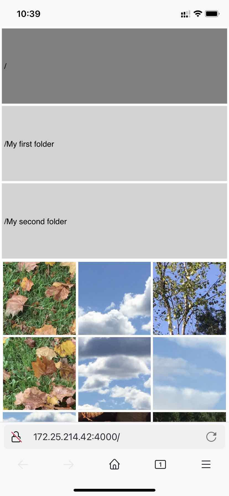
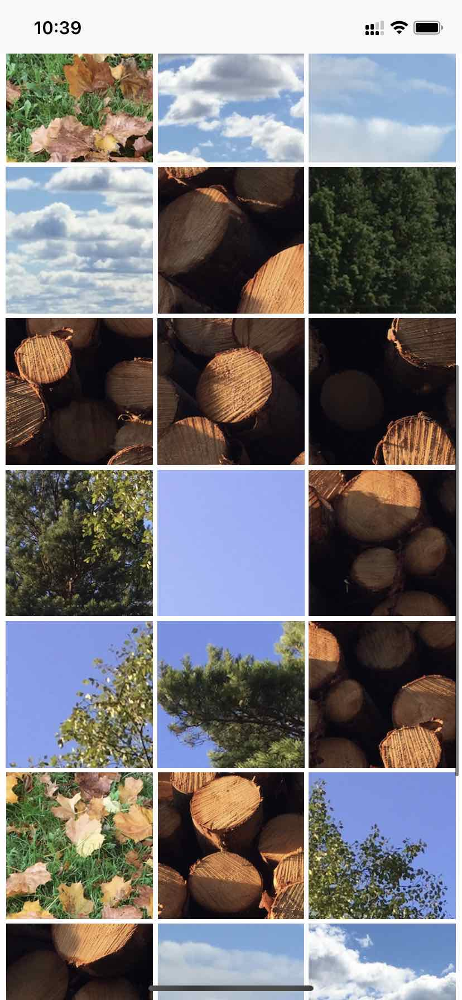
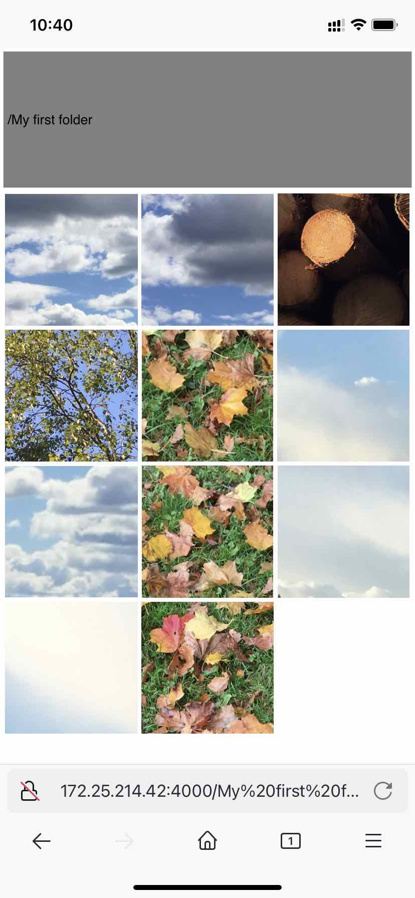
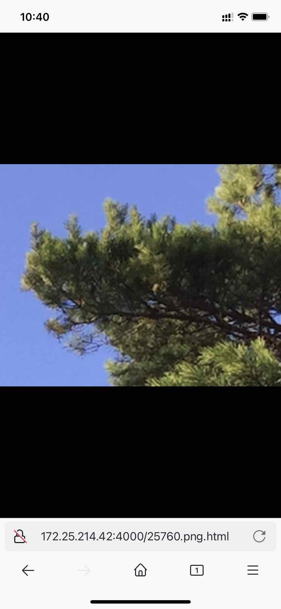

# HTTPImageServer

Smartphones like Android and iPhone allow you to scroll and browse through your photo collection blazingly fast. But what if you don't have all your photos on your smartphone? Perhaps you store your family photos - taken over tens of years - in a more traditional way, i.e. as files and folders? This means you have full control over them, and can backup them in your own way, etc. But it makes it difficult to view them conveniently. This is where `HTTPImageServer` comes in.

`HTTPImageServer` is a webserver that displays photos stored in the local file system as a webpage. It's designed to mimic a typical smartphone's photos app, i.e. be fast and have the possibility to show photos as a grid. Below are some examples.

---

    
    &nbsp; &nbsp; &nbsp; &nbsp;
    
    &nbsp; &nbsp; &nbsp; &nbsp;
    
    &nbsp; &nbsp; &nbsp; &nbsp;
    

*The first three images show the scrollable grid view of images. It also shows buttons for folders. The last image shows the fullscreen view. In the fullscreen view, you can click left or right to change image, or click at the top to go back to the grid view.*

---

Because `HTTPImageServer` uses HTML, it can be used for both Android and iPhone, and even computers too. The user interface is pretty rudimentary, but all the basic functionality is there.

`HTTPImageServer` can be used with the original photos directly, but to make it fast, the photos need to be compressed. To achieve that, my other project [ImageMapper](https://github.com/osklunds/ImageMapper) can be used to compress the photos.

I actually use `HTTPImageServer` for real world use. I use `ImageMapper` to periodically map my (original) family photos to two parallell folder hierachies: thumbnail-sized and mobile-sized. Then `HTTPImageServer` uses the thumbnail-sized photos for the grid view and the mobile-sized photos for the fullscreen view. In this way I can view all my family photos from my smartphone just as if they were directly on my smartphone. Thanks to VPN I can access `HTTPImageServer` away from home too.

## Starting the server

`HTTPImageServer` is written in Haskell and this project is based on cabal. It has been tested on Linux. You need to [install the GHC toolchain](https://www.haskell.org/ghcup/) first if you haven't already.

Type `cabal repl` for a ghci-shell.

Type `cabal run HTTPImageServer -- thumbnail_path fullsize_path port` to start the server. `thumbnail_path` is the path to the thumbnail-sized photos. `fullsize_path` is the path to the full-size photos. The two paths' folder/file structure must be identical - only the image content may differ. This can be achieved with [ImageMapper](https://github.com/osklunds/ImageMapper). `thumbnail_path` and `fullsize_path` can also be the same. `port` is the port number the server will listen to.

After starting the server, go to `127.0.0.1:port` to use it.

## Using the web page

### Grid view

- Scroll to browse through the photos.
- Press a photo to open it in fullscreen view.
- Press a light gray button to open a folder.
- Press the dark gray button to go one folder up.

### Fullscreen view

- Press somewhere towards the right to move to the next photo.
- Press somewhere towards the left to move to the previous photo.
- Press somewhere towards the top to move back to the grid view.

## Compatibility

I have developed and tested `HTTPImageServer` on Linux and Docker. It might work on Mac too, but probably not on Windows.

## Docker

A Docker version of `HTTPImageServer` exists in the `docker` folder. Some helpful commands to run inside the `docker` folder:

- `docker compose build` to build.

- `docker compose up` to run.

- `./build-tag-and-save-image.sh` to build, tag and save the built image in one go. The saved image can be loaded into wherever you want to run your Docker containers.

`docker-compose.yaml` is used during development for easy building and testing. It also serves as documentation of the volumes needed when running the container. It can be used as a reference when you create your own compose file.

For information and an example on how to run `HTTPImageServer` containers with `ImageMapper` containers, check [the ImageMapper repository](https://github.com/osklunds/ImageMapper).

## TODOs

- Keyboard navigation
- Swipe navigation
- Calculate position when going to parent rather than saving
- Flicker-free switching (by using javascript or AJAX?)
